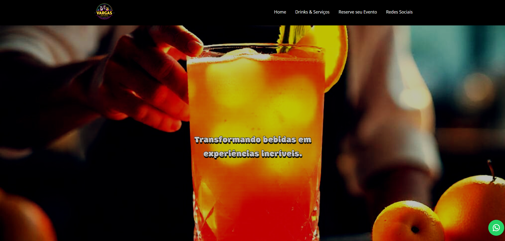

# Vargas Drinks

Site institucional desenvolvido para a empresa **Vargas Drinks**, especializada em serviços de bar e coquetelaria.

Este projeto foi desenvolvido com foco em performance, responsividade e experiência do usuário, além de conter integração com funcionalidades essenciais para conversão e contato com o cliente.

## 🔗 Acesse o site

https://vargasdrinks.com.br/

## 🛠 Tecnologias utilizadas

- **HTML5**  
- **CSS3**  
- **JavaScript**  
- **Swiper.js** (slides interativos)  
- **Font Awesome** (ícones)  
- **PHP** (back-end e envio de e-mails)  
- **PHPMailer** (disparo de e-mails via formulário de contato)

## ✉️ Funcionalidade do Formulário

O formulário de contato envia mensagens via PHPMailer, mas **de forma dinâmica**, utilizando JavaScript (fetch API). Isso permite:

- Envio de e-mails sem recarregar a página  
- Reset automático do formulário após envio  
- Experiência mais fluida e moderna

> **Observação:** As credenciais de envio foram removidas do repositório por segurança. Este repositório é uma versão adaptada para fins de portfólio. Nenhuma informação sensível do cliente foi incluída. Para testar localmente, configure suas próprias variáveis no arquivo de back-end (`enviar-formulario.php`) ou use um `.env`.

## 📱 Recursos implementados

- Layout responsivo e moderno  
- Slides dinâmicos com Swiper.js
- Galeria de fotos do cliente  
- Navegação dinâmica com scroll suave entre seções  
- Botão flutuante de conversa via WhatsApp  
- Links para redes sociais  
- URLs amigáveis (clean URLs para melhor SEO)  
- Metadados configurados para otimização nos mecanismos de busca  
- Código limpo e bem estruturado
- Funciona em todos os navegadores

## 📸 Preview do projeto:
 
--
  ##📁 Como rodar localmente
1. Clone este repositório:
   ```bash
   git clone https://github.com/seu-usuario/vargasdrinks.git
  Instale o PHPMailer (caso ainda não tenha):
  
  bash
  Copiar
  Editar
  composer require phpmailer/phpmailer
  Configure as variáveis de e-mail no enviar-formulario.php ou usando .env.
  Recomendo usar o Mailtrap para disparo de email simulado
  
  Coloque o projeto em um servidor local com suporte a PHP (ex: XAMPP, Laragon).
  
  Acesse via navegador: http://localhost/seu-diretorio/
  
  📩 Contato
  
  Caso tenha interesse em projetos como este ou queira conversar, estou disponível:
  
  https://www.linkedin.com/in/pedro-henrique-39148b2a1/
  
  dev.pedrohenrique.contato@gmail.com
  
  Desenvolvido por Pedro Henrique Silva Vieira
